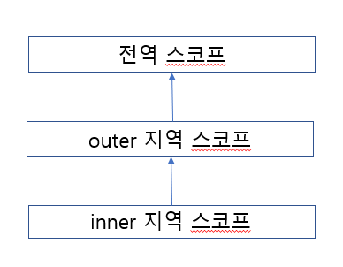

## 스코프
모든 식별자(변수 이름, 함수 이름, 클래스 이름 등)는 자신이 선언된 위치에 의해 다른 코드가 식별자 자신을 참조할 수 있는 유효 범위가 결정된다.<br />
이를 `스코프`라고 한다. 스코프는 `식별자가 유효한 범위`를 말한다.

이름이 같은 변수가 있을 때, (함수 내부, 외부에 한개씩)<br />
자바스크립트 엔진은 두 개의 변수 중 어떤 변수를 참조할 지를 결정해야하는데, 이를 `식별자 결정`이라고 한다.<br />
자바스크립트 엔진은 스코프를 통해 어떤 변수를 참조해야 할 것인지 결정한다.<br />
따라서 `스코프`란 `자바스크립트 엔진이 식별자를 검색할 때 사용하는 규칙`이라고도 할 수 있다.


스코프라는 개념이 없으면 같은 이름을 갖는 변수는 충돌을 일으키므로 프로그램 전체에서 하나 밖에 사용할 수 없게 된다.<br />
스코프 내에서 식별자는 유일해야 하지만 다른 스코프에는 같은 이름의 식별자를 사용할 수 있다. <br />
즉, <b>스코프는 네임스페이스</b>다.

<br />

💡 코드의 문맥과 환경<br />
코드가 어디서 실행되며 주변에 어떤 코드가 있는지를 `렉시컬 환경`이라고 한다.<br />
즉, 코드의 문맥은 렉시컬 환경으로 이뤄진다.<br />
이를 구현한 것이 `실행 컨텍스트`이며, 모든 코드는 실행 컨텍스트에서 평가되고 실행된다.

<br />

💡 var 키워드로 선언한 변수
var 키워드로 선언된 변수는 같은 스코프 내에서 중복 선언이 허용된다.<br />
따라서 의도치 않게 변수값이 재할당되어 변경되는 부작용을 발생시킨다.<br />
하지만 let, const로 선언된 변수는 같은 스코프 내의 중복 선언을 허용하지 않는다.

<br />

### 스코프의 종류
코드는 전역(global)과 지역(local)으로 구분할 수 있다.<br />
변수는 자신이 선언된 위치에 의해 스코프가 결정되므로 <br />
`전역`에서 선언된 변수는 `전역 스코프`를 갖는 `전역 변수`이고,<br />
`지역`에서 선언된 변수는 `지역 스코프`를 갖는 `지역 변수`이다.

<br />

전역 변수는 어디서든지 참조할 수 있다.
지역 변수는 자신의 지역 스코프와 하위 지역 스코프에서 유효하다.

하나의 함수 내부에 전역 변수에 선언된 변수의 이름과 같은 변수가 있고,<br />
그 함수 내부에서 해당 변수를 참조할 때,<br />
전역 변수를 참조하는 것이 아니라 함수 내부에 선언된 변수를 참조한다.<br />
이는 자바스크립트 엔진이 `스코프 체인`을 통해 참조할 변수를 검색했기 때문이다.

<br />

## 스코프 체인

함수는 전역에서 정의할 수도 있고 함수 몸체 내부에서 정의할 수도 있다.<br />
이처럼 함수는 중첩될 수 있으므로 함수의 지역 스코프도 중첩될 수 있다.<br />
이는 <b>스코프가 함수의 중첩에 의해 `계층적 구조`를 갖는다</b>는 것을 의미한다.

중첩 함수의 지역 스코프는 중첩 함수를 포함하는 외부 함수의 지역 스코프와 ㅖ층적 구조를 갖는다.<br />
이때 외부 함수의 지역 스코프를 중첩 함수의 `상위 스코프`라 한다.

<br />


```jsx
var x;
function outer() {
    var y;
    function inner() {
        var x;
    }
}
```
<br />



위의 코드와 같은 상황에서 outer의 스코프는 inner의 상위 스코프이고,<br />
outer의 상위 스코프는 전역 스코프이다.

모든 스코프는 하나의 계층적 구조로 연결되며, 모든 지역 스코프의 최상위 스코프는 `전역 스코프`이다.<br />
이렇게 스코프가 계층적으로 연결된 것을 `스코프 체인`이라고 한다.

<br />

변수를 참조할 때 자바스크립트 엔진은 스코프 체인을 통해 변수를 참조하는 코드의 스코프에서 시작하여<br />
상위 스코프 방향으로 이동하며 선언된 변수를 검색한다.

스코프 체인은 물리적인 실체로도 존재하는데,<br />;
자바스크립트 엔진은 코드를 실행하기에 앞서 렉시컬 환경을 실제로 생성한다.<br />
변수 선언이 실행되면 변수 식별자가 렉시컬 환경에 키로 등록되고 변수 할당이 일어나면 값을 변경한다.<br />
변수의 검색도 이 자료구조 상에서 이뤄진다.

